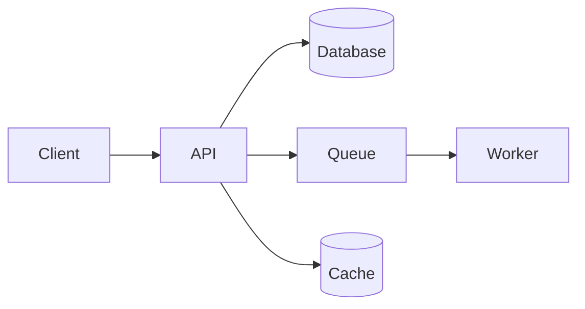

# Architecture template

1. Context: users, external systems.
2. Components: frontend, API/backend, workers/queues, database, cache, storage, auth, integrations. Responsibilities and boundaries.
3. Data flow for key scenarios (login, main transaction, payment, report).
4. Multi-tenancy (if any): shared DB with tenant_id vs schema vs DB per tenant; isolation tests.
5. Cross-cutting: auth/RBAC, logging, error handling, configuration, i18n, audit trail.
6. Scalability and performance: caching, indexing, pagination, background jobs.
7. Deployment view: environments, containers, CDN, CI/CD.
8. Decisions (ADR style): decision, options, reason, consequences.
9. Risks and trade-offs.

Diagram (mermaid):

Choose boring, proven tech that fits team skills; justify exceptions in TECH_STACK.
